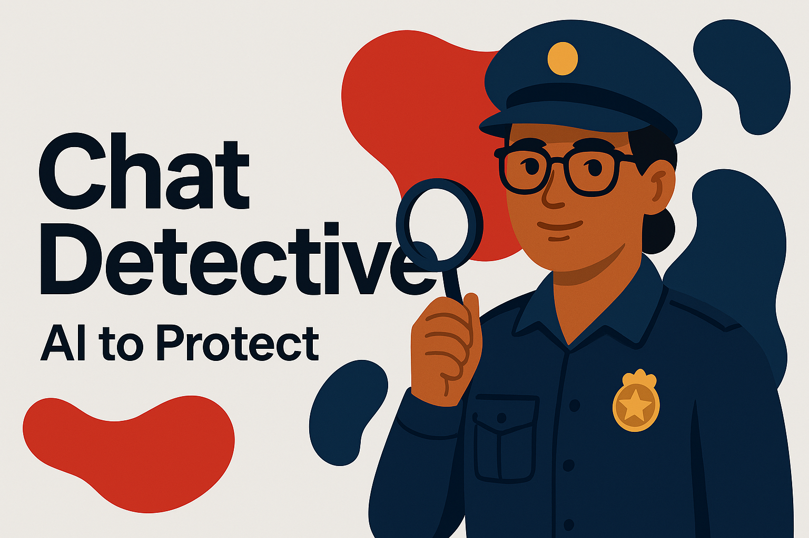
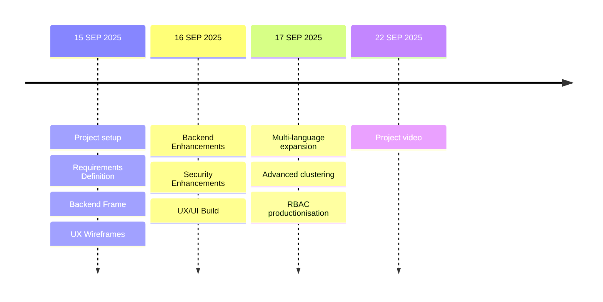

# Chat Detective | Microsoft Hackathon 2025



> Mission Statement  
Empower investigative and intelligence teams to rapidly identify risks, threats, and key actors hidden within large volumes of chat data—while preserving privacy, ensuring auditability, and enabling responsible, defensible AI‑driven decisions.

---

## 1. What Is This Project?

Chat Detective is an agentic AI application built during **[Microsoft Hackathon 2025](https://innovationstudio.microsoft.com/hackathons/hackathon2025/project/100453)**.  
It ingests raw chat transcripts in bulk (e.g., messaging platforms, exported logs, case evidence) and helps analysts:

- Surface entities (people, locations, orgs, handles, aliases)
- Identify risky behaviours (threats, coercion, fraud indicators, extremism signals)
- Summarise long multi-party threads
- Highlight temporal patterns & escalation
- Produce exportable, audit‑friendly reports

Designed for air‑gapped or controlled environments, Chat Detective emphasises security, transparency, and modular deployment.

---

## 2. About Microsoft Hackathon 2025

The Microsoft global hackathon is an annual internal innovation event where teams prototype bold ideas across AI, productivity, sustainability, trust, and more.  
This project targets the intersection of:

- Trustworthy AI in sensitive intelligence workflows  
- Augmented analytical decision‑making  
- Secure, compliant AI orchestration patterns  

You can view the public-facing project entry here:  
👉 **Project Page:** https://innovationstudio.microsoft.com/hackathons/hackathon2025/project/100453

---

## 3. Why Chat Detective?

| Challenge | Existing Pain | How Chat Detective Helps |
|-----------|---------------|--------------------------|
| Volume overload | Thousands of chat messages per case | Summarisation + semantic clustering |
| Hidden risk signals | Manual keyword scanning | Pattern & intent detection |
| Disconnected context | Identities & aliases fragmented | Entity linking & timeline views |
| Compliance pressure | Outputs hard to justify | Transparent reasoning & audit artefacts |
| Deployment constraints | Cloud‑only tooling | Deployable on‑prem / VNet / containerised |

---

## 4. Core Features (Current & Planned)

### Delivered (Hackathon Scope)
- Multi-file transcript ingestion
- Entity extraction & categorisation
- Threat phrase / intent detection (rule + model hybrid)
- Conversation summarisation (thread‑level + global)
- Analyst notes + export (basic)
- Role-based UI scaffolding (placeholder roles)

### In Progress / Roadmap
- Confidence scoring & explainability panels
- Timeline heat map (frequency & intensity)
- Source‑linked evidence cards
- Model policy enforcement (PII redaction modes)
- Offline / air‑gapped model runner
- Chain‑of‑custody log export (JSON + PDF)
- Multilingual support (language detection + translation pass)

---

## 5. Tech Overview

### 5.1 High-Level Architecture
```
TBA
```

### 5.2 Components
```
TBA
```

### 5.3 Data Flow
```
TBA
```

### 5.4 AI / Model Strategy
```
TBA
```

### 5.5 Security & Compliance Considerations
```
TBA
```

### 5.6 Performance / Scaling (Future)
```
TBA
```

### 5.7 Observability
```
TBA
```

---

## 6. Getting Started

### 6.1 Prerequisites
- Node.js (version TBD)
- Python 3.11+ (if using a Python backend)
- Azure OpenAI / OpenAI API key (if using hosted models)

### 6.2 Clone
```bash
git clone https://github.com/emmasteel/Hackathon-Chat-Detective.git
cd Hackathon-Chat-Detective
```

### 6.3 Environment Variables (Example)
Create `.env`:
```
OPENAI_API_KEY=your_key_here
AZURE_OPENAI_ENDPOINT=https://...
AZURE_OPENAI_DEPLOYMENT=...
DB_CONNECTION_STRING=...
AUTH_AUTHORITY=...
```

### 6.4 Install & Run
```bash
# Backend
cd backend
pip install -r requirements.txt
python main.py

# Frontend
cd ../frontend
npm install
npm run dev
```

### 6.5 Minimal Test (Placeholder)
```
TBA
```

---

## 7. Contributing

### 7.1 Workflow
1. Fork + branch: `feature/<topic>`
2. Add / update tests (if test suite present)
3. Run lint / format
4. Submit PR with:
   - Rationale
   - Before/after screenshots (UI changes)
   - Security implications (if any)

### 7.3 Issues & Discussion
Open issues for:
- Feature proposals
- Architecture questions
- Data model adjustments

---

## 8. Ethical Use & Responsible AI

| Principle | Application |
|-----------|-------------|
| Necessity | Only process case‑relevant transcripts |
| Explainability | Provide traceable evidence for flagged items |
| Privacy | PII minimisation & optional redaction layers |
| Accountability | Audit log for each analytic operation |
| Bias Mitigation | Periodic sampling & evaluation sets (planned) |

If you identify risks (false positives, bias surfaces), please open an issue labelled `responsible-ai`.

---

## 9. Roadmap Snapshot



---

## 10. Limitations (Current)
- Prototype reliability (not production‑certified)
- Limited multilingual accuracy
- Entity disambiguation heuristic only (no knowledge graph yet)
- No full SOC/IR workflow integrations yet

---

## 11. FAQ (Seed)
| Question | Answer (Draft) |
|----------|----------------|
| Does this train on my data? | No, inference only (adjust if architecture differs). |
| Can it run fully offline? | Planned roadmap feature. |
| Is output admissible in court? | Designed for traceability, but requires legal review. |

---

## 12. Licence

> Add licence once selected (e.g., MIT Licence / Apache-2.0 / Proprietary).  
If unlicensed, default GitHub terms apply (no implicit grant).

---

## 13. Acknowledgements
- Microsoft Hackathon 2025 organisers
- Open source NLP / AI ecosystem
- Contributors & reviewers (add handles)

---

## 14. Contact / Maintainers
| Role | Handle |
|------|--------|
| Project Owner | @emmasteel |
| Project Owner | @Smiddy4000 |
| (Add others) | - |

---
